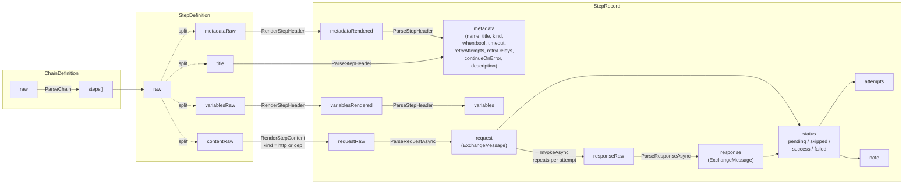

# MCF — Message Chain Format

MCF (Message Chain Format) defines a text-based file format for chaining HTTP and CEP messages — write a sequence of requests in one file, reference earlier responses from later ones, and run it top-to-bottom.

The format deliberately extends the widely-adopted [`.http` / `.rest` file convention](https://learn.microsoft.com/en-us/aspnet/core/test/http-files) so that:

- Each individual step's content remains a valid HTTP or CEP message and can be executed standalone.
- Editors that understand `.http` files (Visual Studio, VS Code REST Client, JetBrains IDEs) still provide useful syntax highlighting; MCF-specific metadata is expressed as comment-prefixed step metadata and is ignored by them.

MCF is inspired by `.http`, but it is not equivalent to `.http`: MCF adds chain semantics (step dependencies, conditional execution, and cross-step response references) that are outside the single-request `.http` model.

Terminology mapping to Microsoft `.http` docs: Microsoft **Variables** correspond to MCF **Variables** (`@name = value`), while Microsoft **Request variables** correspond to MCF **Step Metadata** (`# @name value`).

Global placeholder rule: anywhere MCF supports placeholders, they are interpreted using Liquid template semantics (`{{ ... }}` and ``).

The step-chaining model — where a later step references an earlier step's response via templated placeholders — is inspired by Insomnia's [Chain requests](https://developer.konghq.com/how-to/chain-requests/) feature, reimagined as a plain-text, VCS-friendly file format.

## Format Version

Current version: **MCF/0.1**

File extension: `.mcf`

---

## Terminology

MCF organizes its concepts around four data structures and one engine:

- **ChainDefinition** — the MCF document being executed (static, user-authored).
- **StepDefinition** — the static text view of one step in the chain (raw text only).
- **StepRecord** — the runtime form of an executed step: the rendered header text, the parsed metadata/variables, the request/response objects, the persisted wire texts, and the final status.
- **Scope** — the names visible to the renderer at any point during execution.
- **Engine** — the component that owns the three above and drives them through parse, render, and invoke; scope updates are performed inline by the engine's run loop.

The naming is built around two contrasts that show up everywhere below:

- **definition vs record.** A *definition* is what the user wrote (input). A *record* is what running it produced (output). Liquid rendering against the live `scope` is a runtime operation, so its outputs (`metadataRendered`, `variablesRendered`, `requestRaw`) live on `stepRecord`, not on `stepDefinition`.
- **raw vs rendered vs structured.** *raw* = original text before Liquid rendering; *rendered* = text after Liquid rendering but before semantic parsing; *structured* = parsed in-memory object. For request/response, raw wire texts (`requestRaw`, `responseRaw`) and structured objects (`request`, `response`) are paired through parse/invoke.

### Data

#### ChainDefinition

A **ChainDefinition** is one MCF document.

| Field                             | Definition                                                                                                       |
|-----------------------------------|------------------------------------------------------------------------------------------------------------------|
| `chainDefinition.raw`             | The original text of the MCF document, exactly as on disk (UTF-8, `CRLF` or `LF`, BOM optional).                 |
| `chainDefinition.steps`           | An ordered list of `stepDefinition`, produced by `ParseChain()`.                                                 |

A **separator** is a line whose trimmed content starts with three or more `#` characters; it begins a new step. The first separator may be omitted: content that appears before any `###` and is not a top-level variable or comment is treated as the content of an implicit first step.

#### StepDefinition

A **StepDefinition** is the static, user-authored text view of one step. It captures only the original raw text; rendered/structured derivatives produced at runtime live on the corresponding `stepRecord`.

| Field                                  | Definition                                                                                                                                                                                                                                                                                                                            |
|----------------------------------------|---------------------------------------------------------------------------------------------------------------------------------------------------------------------------------------------------------------------------------------------------------------------------------------------------------------------------------------|
| `stepDefinition.raw`                   | The full raw text of one step, from its `###` separator (exclusive) to the next separator (exclusive) or end of file.                                                                                                                                                                                                                 |
| `stepDefinition.title`                 | The trimmed text that follows the leading `#` characters on the step's `###` separator line. Empty for an implicit first step that has no separator, or when the separator carries no trailing text.                                                                                                                                  |
| `stepDefinition.metadataRaw`           | The `# @name value` lines from the step's header area whose name is a recognized metadata name (see [Step Metadata](#step-metadata)), verbatim. May contain Liquid placeholders. Unrecognized `# @...` lines are plain comments and are not included.                                                                                  |
| `stepDefinition.variablesRaw`          | The `@name = value` lines from the step's header area, verbatim. May contain Liquid placeholders.                                                                                                                                                                                                                                     |
| `stepDefinition.contentRaw`            | Everything after the header area, verbatim. For `http` / `cep` steps it is the request template; for `empty` steps it must be empty (whitespace only).                                                                                                                                                                                |

`metadataRaw` and `variablesRaw` may be interleaved in the source: the header area ends at the first line that is neither a `# @name value` metadata line nor an `@name = value` variable line. The two raw segments retain only their own kind of line and preserve original order within that kind.

`metadataRaw` and `variablesRaw` are rendered together in a single Liquid pass by `RenderStepHeader()`, with the rendered output written to `stepRecord.metadataRendered` / `stepRecord.variablesRendered`. As a consequence, a step-level `@name = value` defined in the header is **not** visible to the same step's `# @when` (and to other metadata values in the same header): the renderer evaluates them all against the parent `scope`. Step-level variables only become visible to the same step's `contentRaw` and to subsequent steps, after the engine's run loop publishes them to `scope.variables`.

#### StepRecord

A **StepRecord** is the runtime form of an executed step. It holds the rendered header text, the parsed view of the step's metadata and variables, the request and response objects, the persisted wire-format texts, and the final status.

| Field                              | Definition                                                                                                                                                                                                                                                                                                                                                |
|------------------------------------|-----------------------------------------------------------------------------------------------------------------------------------------------------------------------------------------------------------------------------------------------------------------------------------------------------------------------------------------------------------|
| `stepRecord.metadataRendered`      | `stepDefinition.metadataRaw` after Liquid rendering against `scope`. Produced by `RenderStepHeader()`; input to `ParseStepHeader()`.                                                                                                                                                                                                                       |
| `stepRecord.metadata`              | The metadata record produced by `ParseStepHeader()` from `stepRecord.metadataRendered`. Fields: `name`, `title`, `kind`, `when`, `timeout`, `retryAttempts`, `retryDelays`, `expectCodes`, `continueOnError`, `description`; see [Step Metadata](#step-metadata). `when` is already a bool here (see [Boolean Metadata](#boolean-metadata)).                                       |
| `stepRecord.variablesRendered`     | `stepDefinition.variablesRaw` after Liquid rendering against `scope`. Produced by `RenderStepHeader()`; input to `ParseStepHeader()`.                                                                                                                                                                                                                      |
| `stepRecord.variables`             | The variables map produced by `ParseStepHeader()` from `stepRecord.variablesRendered`. Keys must match `^[A-Za-z_][A-Za-z0-9_]*$`.                                                                                                                                                                                                                         |
| `stepRecord.requestRaw`            | Request wire text for the step. For `http` / `cep` steps, it is produced by `RenderStepContent()` (Liquid-expanded `contentRaw`) and persisted to disk for replay. Absent (null) for `empty` steps. Produced once on the first attempt and reused across retries.                                                                                          |
| `stepRecord.request`               | The structured **exchange-message** parsed from `stepRecord.requestRaw` by `ParseRequestAsync()`. Absent (null) for `empty` steps. Produced once on the first attempt and reused across retries.                                                                                                                                                            |
| `stepRecord.responseRaw`           | Response wire text for the step, produced by `InvokeAsync()` and persisted to disk for `http` / `cep` steps. Absent (null) for `empty` steps. Holds the **last attempt's** response when retries occurred.                                                                                                                                                  |
| `stepRecord.response`              | The structured **exchange-message** parsed from `stepRecord.responseRaw` by `ParseResponseAsync()`. Absent (null) for `empty` steps. Holds the **last attempt's** response when retries occurred.                                                                                                                                                            |
| `stepRecord.status`                | One of `pending`, `skipped`, `success`, `failed`. The initial value is `pending`; the engine sets it to one of the other three before the record is registered. When retries occurred, this is the **last attempt's** status. See [Step status](#step-status).                                                                                              |
| `stepRecord.attempts`              | The number of times stages 11–12 (`InvokeAsync` / `ParseResponseAsync`) were actually executed for this step. `0` for `skipped` steps and for `http` / `cep` steps that failed at stage 9 (`RenderStepContent`) or stage 10 (`ParseRequestAsync`); `1` for `empty` steps; `≥ 1` for invoked `http` / `cep` steps (the first attempt plus any retries triggered by `# @retry-attempts`).                                                                                  |
| `stepRecord.note`                  | Free-form note describing the outcome. On failure, each failed attempt appends its diagnostic message (newline-separated). When retries occurred and the final status is `failed`, a trailing `" (after N attempts)"` summary is appended.                                                                                                                  |

An **exchange-message** is the in-memory, protocol-agnostic `ExchangeMessage` carrying the request or response side of an exchange. It exposes three fields:

| Field        | Definition                                                                                                                                       |
|--------------|--------------------------------------------------------------------------------------------------------------------------------------------------|
| `metadata`   | Protocol-specific metadata, case-insensitive (HTTP: method/uri/version; CEP: verb/command/protocol).                                             |
| `headers`    | Message headers, case-insensitive.                                                                                                               |
| `content`    | Message body or payload as text, or null when absent.                                                                                            |

The `request` exchange-message is built by the active step handler (`HttpStepHandler` / `CepStepHandler`) which parses `requestRaw` with `HttpRequestMessageConverter.Parse` / `CepRequestMessageConverter.Parse` and maps the native protocol object to `ExchangeMessage`. The `response` exchange-message is built the same way, by mapping the native response parsed with `HttpResponseMessageConverter.Parse` / `CepResponseMessageConverter.Parse`. The native protocol objects never leak onto `stepRecord`.

#### Scope

A **Scope** is the set of names visible to the renderer at a given point during execution.

| Field                | Definition                                                                                                                                                                                                                                                  |
|----------------------|-------------------------------------------------------------------------------------------------------------------------------------------------------------------------------------------------------------------------------------------------------------|
| `scope.variables`    | All variables applied so far, including top-level and step-level `@name = value` definitions, plus any names the host application seeds before `RunAsync` (the MCF library does not seed any predefined variables itself). Keys are case-sensitive and must match `^[A-Za-z_][A-Za-z0-9_]*$`.                       |
| `scope.records`      | The stepRecord of every step that has finished executing (including skipped ones), keyed by `stepRecord.metadata.name` and preserving execution order. Each entry exposes `.metadata`, `.variables`, `.requestRaw`, `.request`, `.responseRaw`, `.response`, `.status`, and `.note`.                                          |

Precedence when names collide: `scope.records` > `scope.variables`.

### Behavior

#### Renderer

The **Renderer** is the template engine that expands placeholders against the current `scope`. MCF uses [Liquid](https://shopify.github.io/liquid/); see [Variable Expansion](#variable-expansion).

#### Engine

The **Engine** (`ChainEngine`) owns one `scope`, the current `chainDefinition`, a cursor `currentStep` pointing at the `stepDefinition` currently being processed, and a cursor `currentRecord` pointing at its in-flight `stepRecord`. It exposes the operations below; scope updates (`scope.variables`, `scope.records`) are not separate operations — the engine's run loop assigns into them inline.

The verbs are layered:

- **parse** — text → in-memory structured object (covers chain decomposition, header parsing, request/response parsing).
- **render** — text → text, Liquid expansion against `scope`.
- **invoke** — `requestRaw` → `responseRaw` plus a tentative `status`, performed by a kind-specific `StepHandler` (`HttpStepHandler` / `CepStepHandler`).

| Operation                          | Effect                                                                                                                                                                                                                                                                                                                                |
|------------------------------------|---------------------------------------------------------------------------------------------------------------------------------------------------------------------------------------------------------------------------------------------------------------------------------------------------------------------------------------|
| `RunAsync(chainRaw, ct)`           | Chain entry point. Sets `chainDefinition.raw = chainRaw`, clears `scope`, runs `ParseChain()`, then iterates the steps via the internal run loop (see pseudocode below).                                                                                                                                                              |
| `ParseChain()`                     | Splits `chainDefinition.raw` into an ordered list of `stepDefinition` written to `chainDefinition.steps`, and within each `stepDefinition` captures `title` from the `###` separator and categorizes the body into the three fixed slots `metadataRaw`, `variablesRaw`, `contentRaw`. Performs no Liquid rendering.                   |
| `RenderStepHeader()`               | Renders `currentStep.metadataRaw` and `currentStep.variablesRaw` together in a single Liquid pass against `scope`, writing `currentRecord.metadataRendered` and `currentRecord.variablesRendered`. Runs once per step (not repeated on retry).                                                                                         |
| `ParseStepHeader()`                | Parses `currentRecord.metadataRendered` and `currentRecord.variablesRendered` into `currentRecord.metadata` and `currentRecord.variables`. Also copies `currentStep.title` to `currentRecord.metadata.title` (null when blank). The `when` value is converted to a bool here per [Boolean Metadata](#boolean-metadata). Runs once per step (not repeated on retry). |
| `RenderStepContent()`              | Renders `currentStep.contentRaw` against `scope` (already augmented with `currentRecord.variables`) and writes the result directly to `currentRecord.requestRaw`. Only invoked for `http` / `cep` steps. Runs once per step (not repeated on retry).                                                                                  |
| `ParseRequestAsync(ct)`            | Selects the `StepHandler` for `currentRecord.metadata.kind` and asks it to parse `currentRecord.requestRaw` into `currentRecord.request` (an `ExchangeMessage`). The handler retains the native protocol object internally for `InvokeAsync`. Runs once per step (not repeated on retry).                                              |
| `InvokeAsync(handler, ct)`         | Asks the handler to dispatch the previously parsed native request, writes `currentRecord.responseRaw`, and sets `currentRecord.status` (`success` / `failed`). See [Step status](#step-status). Honors `currentRecord.metadata.timeout` for **each attempt**. Re-executed on every retry.                                              |
| `ParseResponseAsync(handler, ct)`  | Asks the handler to parse `currentRecord.responseRaw` into `currentRecord.response` (an `ExchangeMessage`). Re-executed on every retry.                                                                                                                                                                                                |

Request / response parsing are delegated through `StepHandler` to `HttpRequestMessageConverter` / `HttpResponseMessageConverter` and `CepRequestMessageConverter` / `CepResponseMessageConverter`.

The lifecycle in pseudocode:

```text
engine.RunAsync(chainRaw, ct):
    scope.variables.clear(); scope.records.clear()
    chainDefinition.raw = chainRaw
    ParseChain()                                                 # → chainDefinition.steps → stepDefinition.{raw, title, metadataRaw, variablesRaw, contentRaw}
    for each step in chainDefinition.steps:
        engine.currentStep = step
        record = engine.currentRecord = new StepRecord()         # record.status starts as "pending"; record.attempts = 0
        RenderStepHeader()                                       # → record.{metadataRendered, variablesRendered}
        ParseStepHeader()                                        # → record.{metadata, variables}   (metadata.when already bool)
        validate uniqueness of record.metadata.name
        if record.metadata.when == false:
            record.status = "skipped"                            # record.attempts stays 0
            scope.records[record.metadata.name] = record
            continue
        for each (name, value) in record.variables:
            scope.variables[name] = value                        # visible to contentRaw and to subsequent steps
        if record.metadata.kind == "empty":
            record.status = (contentRaw is whitespace-only) ? "success" : "failed"
            record.attempts = 1
        else:
            try (with optional timeout from record.metadata.timeout):
                RenderStepContent()                              # → record.requestRaw  (once per step)
                handler = ParseRequestAsync(ct)                  # → record.request     (once per step)
            on timeout / exception:
                record.status = "failed"; append <message> to record.note
                # render/parse failure is terminal; no retries
            if record.status != "failed":
                loop:                                            # attempt loop
                    record.attempts += 1
                    try (with optional timeout from record.metadata.timeout):
                        InvokeAsync(handler, ct)                 # → record.{responseRaw, status}
                        ParseResponseAsync(handler, ct)          # → record.response
                    on timeout / exception:
                        record.status = "failed"; append <message> to record.note
                    if record.status == "success": break
                    if record.attempts > record.metadata.retry: break    # retries exhausted
                    delay = record.metadata.retryDelays[min(record.attempts, len)-1]   # repeat last on overflow; no wait when list empty
                    if delay > 0: wait(delay, ct)
                if record.status == "failed" and record.attempts > 1:
                    append " (after {record.attempts} attempts)" to record.note
        scope.records[record.metadata.name] = record
        if record.status == "failed" and record.metadata.continueOnError == false:
            break
```

### Step lifecycle

The diagram below traces a single step through the engine. Nodes are grouped by their owning data structure (ChainDefinition / StepDefinition / StepRecord); arrow labels name the engine operation that produces the target field. After execution the engine also publishes `record.variables` to `scope.variables` and the whole `record` to `scope.records[record.metadata.name]` (not drawn).



Reading the diagram:

- **ChainDefinition → StepDefinition.** `ParseChain()` populates `chainDefinition.steps`; for each `stepDefinition`, the same pass splits `raw` into `title`, `metadataRaw`, `variablesRaw`, `contentRaw` (dotted arrows).
- **StepDefinition → StepRecord (header).** `RenderStepHeader()` produces `metadataRendered` / `variablesRendered`; `ParseStepHeader()` then yields `metadata` (which also receives `title` from the separator) and `variables`.
- **StepRecord variables → Scope.** The engine's run loop publishes `record.variables` to `scope.variables` so that `contentRaw` and subsequent steps can see them.
- **StepDefinition → StepRecord (request/response).** For `http` / `cep` steps, `RenderStepContent()` writes `requestRaw` and `ParseRequestAsync()` produces `request` — both run **once** per step. `InvokeAsync()` writes `responseRaw` and sets `status`, then `ParseResponseAsync()` produces `response`; this attempt loop repeats up to `record.metadata.retry` extra times when an attempt fails, with `record.attempts` counting each iteration and `record.note` appending each attempt's diagnostic. `responseRaw` / `response` / `status` end up holding the last attempt's values.
- **StepRecord → Scope.records.** After execution, the whole `stepRecord` is registered under `record.metadata.name`, making it visible to subsequent steps' templates.

---

## Execution Semantics

This section specifies how the **runner** executes a chain. It builds on the terms defined above and mirrors the [Step lifecycle](#step-lifecycle) diagram.

### Chain execution

1. The document is split into step blocks in document order; each block is one step's **step-template**.
2. The runner **runs** the chain by processing steps sequentially in document order, maintaining a shared **Scope** across steps.
3. On failure, the chain stops unless the failing step declared `# @continue-on-error true`.
4. Cancellation of the chain cancels the in-flight step and aborts subsequent steps.

### Per-step execution

For each step, the runner performs the following stages in order:

1. **Parse chain.** `ParseChain()` splits the document into `stepDefinition`s and decomposes each into `title` / `metadataRaw` / `variablesRaw` / `contentRaw`. (Done once per chain, before the per-step loop.)
2. **Render step-header.** The renderer expands `metadataRaw` and `variablesRaw` together against the current scope (a single Liquid pass), producing `record.metadataRendered` and `record.variablesRendered`. Runs **once** per step.
3. **Parse step-header.** The step-parser parses `record.metadataRendered` and `record.variablesRendered` into `record.metadata` and `record.variables`. `record.metadata.title` is copied from `stepDefinition.title` (null when blank). `record.metadata.when` is converted to a bool here per [Boolean Metadata](#boolean-metadata). Runs **once** per step.
4. **Validate step name.** The runner ensures `record.metadata.name` is non-empty and unique within the chain so far; a duplicate raises a format error.
5. **Evaluate `when`.** If `record.metadata.when == false`, the step is **skipped** (`status = skipped`, `attempts = 0`); the record is registered to `scope.records` and no further stages run.
6. **Apply `record.variables`.** The runner copies each `(name, value)` from `record.variables` into `scope.variables`, making them visible to the step's `contentRaw` and to subsequent steps. (They are **not** visible to the same step's `@when` or other header metadata, because the header is rendered as one pass against the parent scope.)
7. **Resolve kind.** The step kind (`http` / `cep` / `empty`) is determined from `record.metadata.kind` per [Kind Resolution](#kind-resolution).
8. **`empty` short-circuit.** If `record.metadata.kind == "empty"`, the runner inspects `contentRaw`: if it is whitespace-only the status is `success`, otherwise `failed`; `record.attempts` is set to `1`. The remaining stages are skipped.
9. **Render step-content.** For `http` / `cep` steps, the renderer expands `contentRaw` against the updated scope and writes the result directly to `record.requestRaw`. Runs **once** per step. From this stage on, work runs under a per-step cancellation that combines the chain token with `record.metadata.timeout` (when set); the timeout applies to **each attempt** of stages 11–12, not to the cumulative duration.
10. **Parse request.** `ParseRequestAsync(record.requestRaw, ct)` is delegated to a kind-specific `StepHandler` (`HttpStepHandler` / `CepStepHandler`), which parses the wire text via the matching converter and produces `record.request` (an `ExchangeMessage`). The handler retains the native protocol object internally for the next stage. Runs **once** per step.
11. **Invoke.** `InvokeAsync(handler, ct)` dispatches the previously parsed native request, writes `record.responseRaw`, and sets `record.status` (`success` / `failed`). Each entry to this stage increments `record.attempts` by 1.
12. **Parse response.** `ParseResponseAsync(handler, ct)` produces `record.response` (an `ExchangeMessage`) from `record.responseRaw`.
13. **Handle timeout / exception.** If stages 9–12 throw, `record.status` is set to `failed` and the message is appended to `record.note` (the timeout case uses the configured `# @timeout` value). Cancellation triggered by the chain token propagates out unchanged.
14. **Retry.** When stages 11–12 just produced `record.status == failed`:
    - If `record.attempts > record.metadata.retry`, retries are exhausted; if `record.attempts > 1`, append `" (after {record.attempts} attempts)"` to `record.note` and proceed to stage 15.
    - Otherwise wait for `record.metadata.retryDelays[k-1]` (where `k = min(record.attempts, retryDelays.length)`; no wait when `retryDelays` is empty), responding to chain cancellation, then re-enter stage 11. Stages 9–10 are **not** repeated.
15. **Register step.** The completed `record` is added to `scope.records` under `record.metadata.name`, exposing `.metadata`, `.variables`, `.requestRaw`, `.request`, `.responseRaw`, `.response`, `.status`, `.attempts`, and `.note` to subsequent steps. (`empty` steps do not have `requestRaw` / `request` / `responseRaw` / `response`; skipped steps do not have any of those either.)
16. **Stop on failure.** If `record.status == failed` and `record.metadata.continueOnError == false`, the run loop exits without processing further steps.

Example — a header that uses parent-scope variables, then a content that uses the header-defined variables:

```
### send message
# @name second
# @kind http
# @when truefalse
@hostname = {{server1}}
@port = {{port1}}
POST {{hostname}}:{{port}}/post HTTP/1.1
Host: httpbin.org
Content-Type: application/json

{
  "name": "{{first.response.body.$.headers.Host}}"
}
```

Stages 2–3 render the step-header (`# @when`, `@hostname`, `@port`) in one Liquid pass against the parent scope — so `# @when` sees `first` (a previously registered step) and the `@hostname` / `@port` lines see `server1` / `port1` (parent-scope variables), but **not** each other. Stage 6 then publishes `@hostname` / `@port` to the scope. Stage 9 renders the request line, headers, and body with those values already visible.

### Step status

A `stepRecord.status` starts as `pending` and is set to one of `skipped`, `success`, or `failed` before the record is registered. When retries occur, `status` reflects the **last attempt** only:

| Status      | Condition                                                                                                                          |
|-------------|------------------------------------------------------------------------------------------------------------------------------------|
| `skipped`   | `record.metadata.when` evaluated to `false`. `record.attempts == 0`.                                                              |
| `failed`    | `empty`: the step's `contentRaw` contains any non-empty line (an `empty` step must have empty content).                            |
|             | `http`: the response status code is outside `2xx` (or, when `# @expect-codes` is set, does not match any configured pattern).       |
|             | `cep`: the response `ExitCode != 0` (or, when `# @expect-codes` is set, does not match any configured pattern). The `Reason` field is informational and does not affect status. |
|             | Any kind: stages 9–12 threw (including `# @timeout` expiry); each failed attempt's diagnostic is appended to `record.note`.        |
| `success`   | Otherwise.                                                                                                                         |

When `record.metadata.retry > 0`, an `http` / `cep` step that fails an attempt re-enters stages 11–12 (per [Per-step execution](#per-step-execution) stage 14) until it succeeds or `record.attempts > record.metadata.retry`. `record.attempts` counts the actual invocations of stages 11–12 (`0` for `skipped`, `1` for `empty`).

Note: an `empty` step holds its variables in the header (`@name = value` lines, alongside `# @kind` and friends), not in the content area. If a step was intended to be `http` or `cep` but resolved to `empty` because `# @kind` was left empty or omitted incorrectly, the request is not dispatched and the step fails on the first non-empty content line per the rule above.

---

## Document Structure

An MCF document consists of three kinds of top-level constructs, in any order:

1. **Comments** — lines starting with `#`.
2. **Variables** — lines of the form `@name = value`.
3. **Steps** — blocks introduced by a `###` separator line.

```
@baseUrl = https://api.example.com

### login
# @name login
POST {{baseUrl}}/login HTTP/1.1
Content-Type: application/json

{ "user": "alice" }

### fetch video
# @name fetchVideo
# @when truefalse
GET {{baseUrl}}/videos/42 HTTP/1.1
Authorization: Bearer {{ login.response.json.token }}

### transcode
# @name transcode
# @kind cep
EXEC ffmpeg CEP/0.1
Working-Directory: ${USERPROFILE}\Downloads

-i {{ fetchVideo.response.json.url }}
-c:v copy
-y
output.mp4
```

### Encoding and Line Endings

- Files are UTF-8, with or without BOM.
- Both `CRLF` and `LF` line endings are accepted.
- The step content preserves its original line endings verbatim when handed to the inner parser.

---

## Separator

A line whose trimmed content starts with three or more `#` characters, optionally followed by whitespace and a human-readable title, starts a new step:

```
###
### login
###### optional deeper heading, also a separator
```

Anything after the leading `#` run on the same line is treated as the step's **title** (informational only). A step's **step name** comes from `# @name`, not from the title.

The first separator may be omitted: content that appears before any `###` and is not a variable or comment is treated as the content of an implicit first step.

---

## Comments

```
# this is a comment
```

Comments are ignored, except for lines that match the **step metadata** form (in `.http`-style comment syntax):

```
# @<metadata-name> <value>
```

Parsing rules for a step metadata line:

- The line must start with `#` optionally followed by whitespace.
- Immediately after the `#` (and any whitespace) is `@`, followed by a metadata name matching `^[A-Za-z][A-Za-z0-9-]*$`.
- The metadata name is followed by whitespace and then the value (the rest of the line).
- Metadata names are **case-insensitive**. Lowercase is recommended for readability.
- The metadata name must be one of the **recognized names** listed in [Step Metadata](#step-metadata) (`name`, `kind`, `when`, `timeout`, `continue-on-error`, `description`). A `# @<name> ...` line whose name is not in this list is a plain comment, not metadata.

Step metadata may only appear in the **header area** of a step, i.e. between the `###` separator and the first non-metadata, non-comment line of the step content.

Because variables use `@name = value` while step metadata uses `# @name value`, commenting out a variable (`# @base = https://...`) is never mistaken for step metadata.

---

## Variables

```
@name = value
```

Rules:

- `name` matches `^[A-Za-z_][A-Za-z0-9_]*$`.
- Whitespace around `=` is trimmed; the rest of the line is the value, verbatim.
- Variables defined before a step are visible to that step and to every subsequent step.
- Redefinition is allowed; the latest definition wins for subsequent steps.
- Variable values themselves may contain `{{...}}` references to previously defined variables or to earlier steps' responses; these placeholders are evaluated using Liquid template semantics.

---

## Steps

Each step has the following logical shape:

```
### <step-title>
<step-metadata>
<step-content>
```

The `<step-title>` is the trimmed text that follows the leading `#` characters on the `###` separator line. It is **not** parsed via `# @title` metadata; instead, the parser captures it directly from the separator line and exposes it as `record.metadata.title` (null when the separator has no trailing text or for an implicit first step that has no separator).

For a request step, `<step-content>` is the **contentRaw** — the HTTP or CEP wire-format text that, after Liquid rendering, becomes `record.requestRaw` and is parsed into a request-message. For an `empty` step, `<step-content>` must be empty.

### Step Metadata

| Metadata                    | Value                   | Description                                                                                  |
|----------------------------|-------------------------|----------------------------------------------------------------------------------------------|
| `# @name`                  | identifier              | **Required.** The step's **step name**; unique within the chain and used by `{{name.response.*}}` references. Pattern: `^[A-Za-z_][A-Za-z0-9_]*$`. |
| `# @kind`                  | `http` \| `cep` \| empty | Message kind. Optional; see [Kind Resolution](#kind-resolution). An `empty` kind marks a variable-adjustment step: it declares variables in its header only, has no `contentRaw`, and does not dispatch. |
| `# @when`                  | Liquid template         | Conditional execution. The value is rendered as Liquid; the result string is interpreted as a boolean and stored on `record.metadata.when` as a bool (see [Boolean Metadata](#boolean-metadata)). |
| `# @timeout`               | TimeSpan literal (e.g. `00:00:30`) | Per-attempt timeout; overrides the chain default. Applies to **each** invoke/parse-response attempt independently, not to the cumulative duration when retries occur. Parsed via `TimeSpan.TryParse` (invariant culture). |
| `# @retry-attempts`        | int (≥ 0)               | Maximum number of **retry attempts** (not counting the first attempt) for `http` / `cep` steps that produce `status == failed`. Defaults to `0` (no retry). The value is rendered as Liquid first, then parsed as an integer; a negative or non-integer result is a format error. Stored on `record.metadata.retryAttempts`. |
| `# @retry-delays`          | TimeSpan list, comma-separated (e.g. `00:00:01, 00:00:02, 00:00:04`) | Wait times before each retry attempt: the *k*-th retry waits the *k*-th entry; if *k* exceeds the list length, the last entry is repeated; an empty list (or no value) means no wait. Each entry is parsed via `TimeSpan.TryParse`. The value is rendered as Liquid before splitting. Stored on `record.metadata.retryDelays` as a read-only list of `TimeSpan` (empty list when omitted). Waiting responds to chain cancellation. |
| `# @expect-codes`          | Comma-separated digit patterns; each pattern is digits with optional `X` wildcards, case-insensitive (e.g. `200`, `200,201,204`, `2XX,304`, `322,33x`) | Response codes that mark the step as `success`. The "code" is the HTTP status code for `http` steps and `CepResponseMessage.ExitCode` for `cep` steps. Any code that does not match becomes `failed`. When omitted, the kind-specific default applies: `http` → `2XX`, `cep` → `0`. Each entry is a digit-pattern: each `X` (case-insensitive — `X` and `x` are equivalent) is a wildcard matching any digit `0-9`. So `2XX` covers `200..299`, `31x` covers `310..319`, `322` covers only `322`. The value is rendered as Liquid first, then parsed. Stored on `record.metadata.expectCodes` as a read-only list of `(min, max)` integer ranges. |
| `# @continue-on-error`     | Liquid template         | When truthy, continue executing subsequent steps even if this step fails after all retries. Defaults to `false`. Rendered as Liquid and interpreted as a boolean per [Boolean Metadata](#boolean-metadata); stored on `record.metadata.continueOnError` as a bool. |
| `# @description`           | free text               | Human-readable description; runtime metadata only.                                           |

The table above is closed: only these names are recognized as step metadata. A `# @<name> ...` line whose name is not in the table is treated as a plain comment — it is not parsed, not retained on `stepRecord.metadata`, and does not contribute to the header area's metadata segment.

Metadata names use kebab-case in the document (`# @continue-on-error`, `# @retry-delays`); they map to lowerCamelCase property paths on `record.metadata` (`record.metadata.continueOnError`, `record.metadata.retryDelays`).

### Kind Resolution

The runner resolves a step kind from the parsed `record.metadata` value of `# @kind`:

- `http` — `http`
- `cep` — `cep`
- empty value (`# @kind`) or `# @kind` omitted entirely — `empty`

The runner does **not** infer the kind from `contentRaw`. A step that omits `# @kind` (or supplies an empty value) is always treated as `empty`, so `contentRaw` must be whitespace-only or the step fails per [Per-step execution](#per-step-execution) stage 8.

When a step resolves to `empty`, the runner does not render or parse `contentRaw` and there is no request-raw; an `empty` step's `contentRaw` must be empty (whitespace only). Step-level variables for an `empty` step live in the header area (`@name = value` lines mixed with metadata such as `# @kind`).

### Step Content

Everything after the step-header (the `# @...` metadata lines and `@name = value` variable lines), up to the next `###` separator or the end of file, is the **contentRaw**. For `http` and `cep` steps, `contentRaw` is rendered by `RenderStepContent()` and the result becomes `record.requestRaw`. For `empty` steps, `contentRaw` must be empty (whitespace only); the step's variables are declared in the header area instead.

At execution time, the runner first renders the header (`metadataRaw` and `variablesRaw` together in one Liquid pass) and parses it into `record.metadata` and `record.variables`. After the `@when` check passes, `record.variables` is registered to the scope. The runner then handles `contentRaw` according to `record.metadata.kind`:

- `http` — `RenderStepContent()` expands `contentRaw` into `record.requestRaw`, parsed by the **http-parser** (`HttpRequestMessageConverter.Parse`) into a request-message.
- `cep`  — `RenderStepContent()` expands `contentRaw` into `record.requestRaw`, parsed by the **cep-parser** (`CepRequestMessageConverter.Parse`) into a request-message.
- `empty` — `contentRaw` is neither rendered nor parsed; it must be empty. Any non-empty line is an error.

All leading and trailing newline characters (`\r` and `\n`) are stripped from `record.requestRaw` before it is handed to the inner parser. Interior blank lines are preserved because both HTTP and CEP rely on them as section separators. Authors who need a real blank line at the start or end of the body should encode it inside the body proper (for example, a body that ends with `\r\n\r\n` will, after stripping, have its trailing blank line removed; the inner parser must not depend on a trailing blank line).

---

## Variable Expansion

MCF's **Renderer** is [Liquid](https://shopify.github.io/liquid/). In MCF, all placeholders are Liquid templates. `metadataRaw`, `variablesRaw`, `contentRaw`, top-level variable values, and `@when` metadata values may all contain Liquid output (`{{ ... }}`) and tags (``).

Rendering happens in two stages per step. First, `RenderStepHeader()` renders `metadataRaw` and `variablesRaw` together in **one Liquid pass** against the parent scope, producing `metadataRendered` and `variablesRendered`; the step-parser turns these into `record.metadata` and `record.variables`. Because the header is one pass, a step-level `@name = value` defined in the header is **not** visible to the same step's `@when` or to other header values — it only becomes visible after `RegisterVariable` runs. Second, after `record.variables` has been registered to the scope, `RenderStepContent()` renders `contentRaw` against the updated scope, writing the result directly to `record.requestRaw`.

> **Note.** CEP defines its own `${VAR_NAME}` placeholder syntax (see `CEP.md`), resolved by the CEP executor at run time. Liquid uses `{{ ... }}` / `` and does not touch `${...}`, so a CEP step content may freely mix both: `{{ ... }}` is expanded by MCF before dispatch, while `${...}` is passed through unchanged and resolved by CEP.

### Exposed Scope

The following names are available to the renderer:

| Name                | Description                                                                                  |
|---------------------|----------------------------------------------------------------------------------------------|
| `<var>`             | Any variable visible in `scope.variables` (top-level / step-level `@name = value` definitions and any host-seeded names). |
| `<step-name>`       | The **step-object** of a previously executed step. Exposes `.request`, `.response`, `.status`, and `.variables`. |

Precedence when names collide: step names > variables.

### Step-object Fields

For a previously executed step named `<name>`, the step-object exposes:

| Path                  | Value                                                                        |
|-----------------------|------------------------------------------------------------------------------|
| `<name>.status`       | Step status: `success`, `failed`, or `skipped`.                              |
| `<name>.attempts`     | Number of times stages 11–12 actually executed. `0` for `skipped` and for `http` / `cep` that failed before the first invoke; `1` for `empty`; `≥ 1` for invoked `http` / `cep`. |
| `<name>.variables`    | Variables the step defined or updated (primarily for `empty` steps).         |
| `<name>.requestRaw`   | Request wire text for the step. Absent for `empty` steps.                    |
| `<name>.request`      | The **request-message** parsed from the step's `requestRaw`. Absent for `empty` steps.          |
| `<name>.responseRaw`  | Response wire text for the step (last attempt). Absent for `empty` steps.    |
| `<name>.response`     | The **response-message** parsed from the step's `responseRaw` (last attempt). Absent for `empty` steps. |

`.request` and `.response` are structured objects, not the request-raw / response-raw texts on disk.

For a **HTTP** step, `<name>.response` exposes:

| Path                                         | Value                                                           |
|----------------------------------------------|-----------------------------------------------------------------|
| `<name>.response.code`                       | Integer status code (e.g. `200`).                               |
| `<name>.response.reason`                     | Reason phrase token (e.g. `OK`).                                |
| `<name>.response.headers["<Header>"]`        | First header value matching `<Header>` (case-insensitive).      |
| `<name>.response.body`                       | Response body as text.                                          |
| `<name>.response.json`                       | Parsed JSON body, navigable via dot/bracket (Liquid `drop`).    |

For a **CEP** step, `<name>.response` exposes:

| Path                                         | Value                                                           |
|----------------------------------------------|-----------------------------------------------------------------|
| `<name>.response.code`                       | Integer exit code (see `CEP.md`).                               |
| `<name>.response.reason`                     | Reason token (`OK`, `Error`, `Timeout`, `Canceled`, ...).       |
| `<name>.response.headers["<Header>"]`        | First header value matching `<Header>` (case-insensitive).      |
| `<name>.response.payload`                    | Combined stdout/stderr text.                                    |
| `<name>.response.json`                       | Parsed JSON payload, if the payload is valid JSON.              |

Referencing a step that has not yet executed, or does not exist, is an error.

### Filters

All [standard Liquid filters](https://shopify.github.io/liquid/basics/introduction/) are available. Commonly useful ones in an MCF context:

- `default`: `{{ user | default: "anonymous" }}`
- `upcase` / `downcase`
- `url_encode` / `url_decode`
- `json`: `{{ payload | json }}` (emit a JSON-safe representation)
- `strip` / `strip_newlines`
- `date`: `{{ "now" | date: "%Y-%m-%dT%H:%M:%S" }}`

### Undefined Names

Per Liquid semantics, an undefined variable renders as an empty string. Use the `default` filter to supply a fallback when this matters:

```
Authorization: Bearer {{ auth.response.json.access_token | default: "" }}
```

### ``

Use Liquid's `...` block to embed literal `{{ }}` or `` in step content that must not be templated (for example, inside a CEP argument that itself contains Liquid-like syntax).

### Boolean Metadata

Metadata fields whose value type is a **Liquid template** interpreted as a boolean — currently `# @when` and `# @continue-on-error` — share the same evaluation rule. The runner renders the template against the current scope and then converts the rendered string to a boolean:

| Rendered string (case-insensitive, trimmed) | Boolean |
|---------------------------------------------|---------|
| `"true"`, `"yes"`, `"on"`, `"1"`            | true    |
| `"false"`, `"no"`, `"off"`, `"0"`           | false   |
| anything else (including `""`)              | format error |

For `# @when`, the step executes when the boolean is true; otherwise it is skipped. For `# @continue-on-error`, the chain continues past a failed step when the boolean is true. Because empty rendered output is a format error, conditional templates must emit one of the recognized literals on every branch.

For comparisons, wrap a Liquid `` block so it emits a recognized boolean literal on every branch:

```
# @when truefalse
# @when truefalse
# @continue-on-error truefalse
```

When the referenced value is already a boolean or recognized truthy string, a bare output is enough:

```
# @when {{ preflight.response.json.ready }}
# @continue-on-error true
```

Liquid operators available in ``: `==`, `!=`, `<`, `<=`, `>`, `>=`, `contains`, and the boolean operators `and` / `or`.

---

## Compatibility with Single-Request Files

A file that contains no `###` separator and no MCF-specific step metadata is a valid single-request file (either HTTP or CEP). Such a file is **not** automatically dispatched by the MCF runner — `# @kind` must be supplied (typically by adding a header like `# @name one` and `# @kind http` / `# @kind cep` at the top) so the runner knows how to parse the body. Without `# @kind`, the implicit first step resolves to `empty` and any non-empty content fails per [Per-step execution](#per-step-execution) stage 8.

---

## Examples

### Minimal HTTP — CEP chain

```
@baseUrl = https://api.example.com

### fetch token
# @name auth
POST {{baseUrl}}/token HTTP/1.1
Content-Type: application/x-www-form-urlencoded

grant_type=client_credentials

### fetch video url
# @name getVideo
# @when truefalse
GET {{baseUrl}}/videos/42 HTTP/1.1
Authorization: Bearer {{ auth.response.json.access_token }}

### transcode locally
# @name transcode
# @kind cep
EXEC ffmpeg CEP/0.1
Working-Directory: ${USERPROFILE}\Downloads

-i {{ getVideo.response.json.url }}
-c:v copy
-y
output.mp4
```

### Chained CEP steps

```
### list files
# @name ls
EXEC cmd CEP/0.1

/c
dir /b

### ping first host
# @name ping
# @when truefalse
EXEC ping CEP/0.1
Charset: GBK

baidu.com
```

### Conditional branch with continue-on-error

```
### preflight
# @name preflight
# @continue-on-error true
GET {{baseUrl}}/health HTTP/1.1

### main call
# @when truefalse
GET {{baseUrl}}/data HTTP/1.1
```

### Retry on failure

```
### flaky endpoint
# @name flaky
# @timeout 00:00:05
# @retry-attempts 3
# @retry-delays 00:00:01, 00:00:02, 00:00:04
GET {{baseUrl}}/maybe HTTP/1.1

### follow-up
# @name followup
# @when truefalse
GET {{baseUrl}}/data?attempts={{ flaky.attempts }} HTTP/1.1
```

The `flaky` step runs at most `1 + 3 = 4` times. Each attempt has its own `00:00:05` timeout. The waits between attempts are `1s`, `2s`, `4s`; if `# @retry-attempts` were larger than the list length, the last entry (`4s`) would be reused for further retries. After all retries are exhausted, `flaky.status` is `failed` (causing the chain to stop unless `# @continue-on-error true` is set) or `success`; `flaky.attempts` exposes the actual count to subsequent steps.

### Variable-adjustment step

```
@baseUrl = https://api.example.com

### compute runtime values
# @name setup
# @kind
@videoId = {{ env.video_id | default: "42" }}

### fetch video
# @name getVideo
GET {{ baseUrl }}/videos/{{ videoId }} HTTP/1.1
```

An `empty` step's variables live in the header area (`@name = value` lines mixed with `# @...` metadata) and are rendered together with the metadata in one Liquid pass against the parent scope; they do **not** see each other within the same step. They become visible to subsequent steps after the step is registered.
